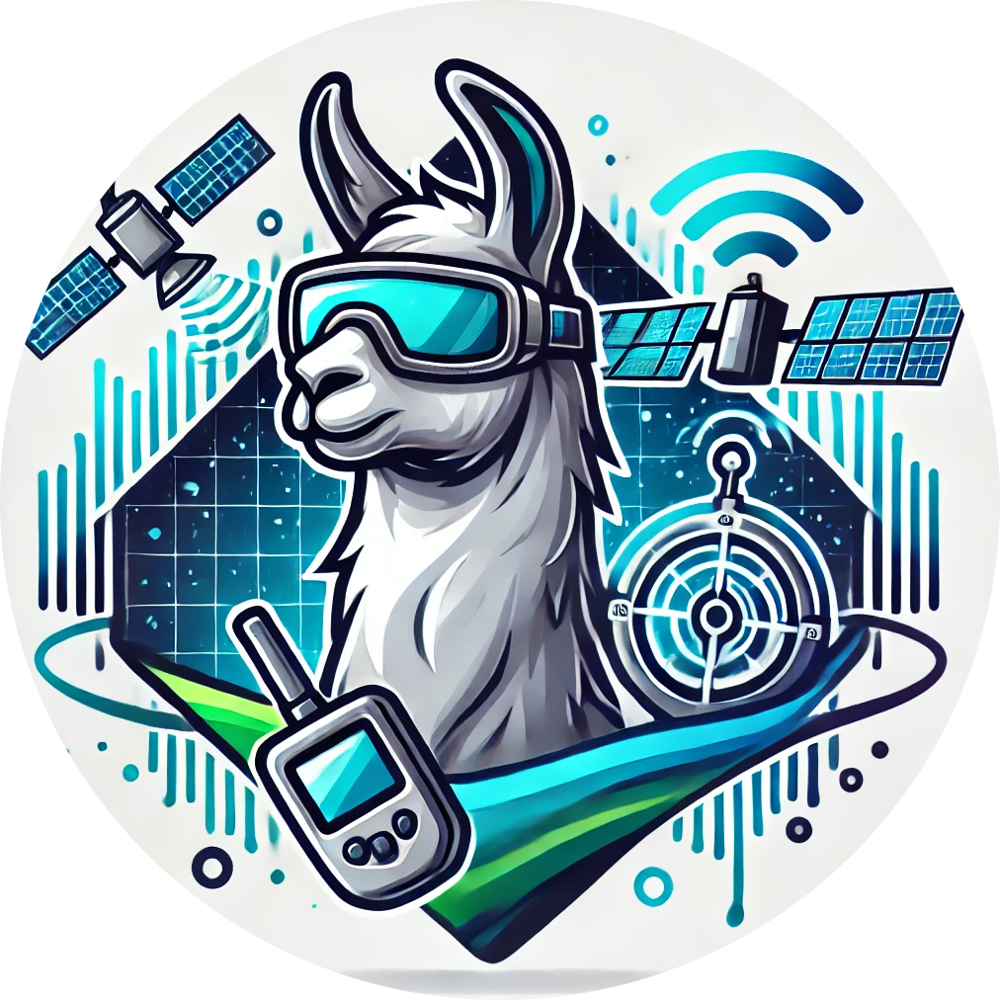

<p align="center">
  
</p>

# UniRS: Unifying Multi-temporal Remote Sensing Tasks through Vision Language Models

#### [Yujie Li](https://scholar.google.com/citations?user=gAfFuhsAAAAJ&hl), [Wenjia Xu](http://wenjia.ruantang.top/)\*, [Guangzuo Li](https://people.ucas.ac.cn/~liguangzuo), [Zijian Yu](https://sites.google.com/site/), [Zhiwei Wei](https://trentonwei.github.io/?continueFlag=24428397aaeb0cc6751570d48a532d36), [Jiuniu Wang](https://jiuniu.ruantang.top/) and [Mugen Peng](https://scholar.google.com/citations?user=85mAZVcAAAAJ&hl)
\* Corresponding author

#### **State Key Laboratory of Networking and Switching Technology, Beijing University of Posts and Telecommunications; Aerospace Information Research Institute, Chinese Academy of Sciences; School of Geographic Sciences, Hunan Normal University; Department of Computer Science, City University of Hong Kong**

[](https://mbzuai-oryx.github.io/GeoChat)
[](https://arxiv.org/abs/2412.20742)
[](https://www.python.org/downloads/release/python-3100/)

---

##  Overview
UniRS is a visual language model (VLM) that integrates multi-temporal remote sensing parsing capabilities. The model can
parse three types of remote sensing inputs (i.e., single images, dual-temporal image pairs, and videos) and give text 
responses based on user instructions. We adopt a modular design that adapts to each task, design an inference mechanism 
that can fully utilize the prior knowledge of the base model ,[VILA-1.5](https://github.com/NVlabs/VILA), and perform 
joint fine-tuning on large-scale datasets, ultimately obtaining a large remote sensing visual language model with excellent
generalization capabilities on multi-temporal remote sensing tasks.

---

## Contents
- [Installation](#installation)
- [Dataset](#dataset)
- [Training](#training)
- [Evaluations](#evaluations)

## 💡 News
- [2025/1] The training code is released!
- [2024/12] [Paper](https://arxiv.org/abs/2412.20742) is on Arxiv!

---

## Installation

```bash
./environment_setup.sh
```

or follow the instructions below in order.

```
conda create -n unirs python=3.10 -y
conda activate unirs

pip install --upgrade pip  # enable PEP 660 support
# this is optional if you prefer to system built-in nvcc.
conda install -c nvidia cuda-toolkit -y
wget https://github.com/Dao-AILab/flash-attention/releases/download/v2.4.2/flash_attn-2.4.2+cu118torch2.0cxx11abiFALSE-cp310-cp310-linux_x86_64.whl
pip install flash_attn-2.4.2+cu118torch2.0cxx11abiFALSE-cp310-cp310-linux_x86_64.whl
pip install -e .
pip install -e ".[train]"

pip install git+https://github.com/huggingface/transformers@v4.36.2
site_pkg_path=$(python -c 'import site; print(site.getsitepackages()[0])')
cp -rv ./llava/train/transformers_replace/* $site_pkg_path/transformers/
```

## Dataset
We mixed three datasets for joint training of UniRS, namely [GeoChat-Instruct](https://huggingface.co/datasets/MBZUAI/GeoChat_Instruct/blob/main/GeoChat_Instruct.json), [LEVIR-CC](https://github.com/Chen-Yang-Liu/RSICC) and [ERA](https://lcmou.github.io/ERA_Dataset/).

## Training

## Evaluations

## Checkpoints


## 🔒 License
- The code is released under the Apache 2.0 license as found in the [LICENSE](./LICENSE) file.
- The pretrained weights are released under the [CC-BY-NC-SA-4.0 license](https://creativecommons.org/licenses/by-nc-sa/4.0/deed.en).
- The service is a research preview intended for non-commercial use only, and is subject to the following licenses and terms:
    - [Model License](https://github.com/facebookresearch/llama/blob/main/MODEL_CARD.md) of LLaMA. For LLAMA3-VILA checkpoints terms of use, please refer to the [LLAMA3 License](https://llama.meta.com/llama3/license/) for additional details.
    - [Dataset Licenses](./data_prepare/LICENSE) for each one used during training.


## Citations

```
@misc{li2024unirsunifyingmultitemporalremote,
      title={UniRS: Unifying Multi-temporal Remote Sensing Tasks through Vision Language Models},
      author={Yujie Li and Wenjia Xu and Guangzuo Li and Zijian Yu and Zhiwei Wei and Jiuniu Wang and Mugen Peng},
      year={2024},
      eprint={2412.20742},
      archivePrefix={arXiv},
      primaryClass={cs.CV},
      url={https://arxiv.org/abs/2412.20742},
}
```

# Acknowledgement
- [LLaVA](https://github.com/haotian-liu/LLaVA), [GeoChat](https://github.com/mbzuai-oryx/GeoChat) and [VILA](https://github.com/NVlabs/VILA): the codebase we built upon. Thanks for their wonderful work.
- [SigLIP](https://github.com/google-research/big_vision): for open-sourcing SigLIP (used in UniRS).
- [GeoChat-Instruct](https://github.com/mbzuai-oryx/GeoChat), [LEVIR-CC](https://github.com/Chen-Yang-Liu/RSICC) and [ERA](https://lcmou.github.io/ERA_Dataset/): the amazing open-sourced datasets!


